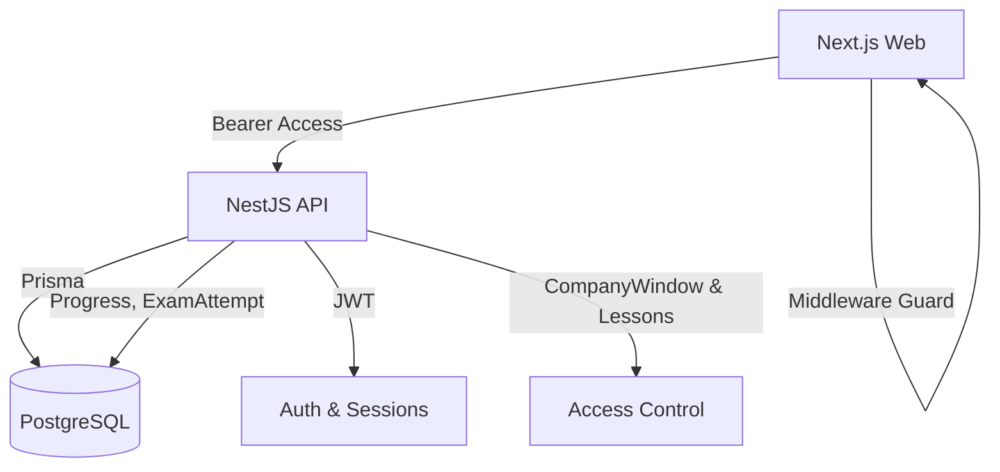
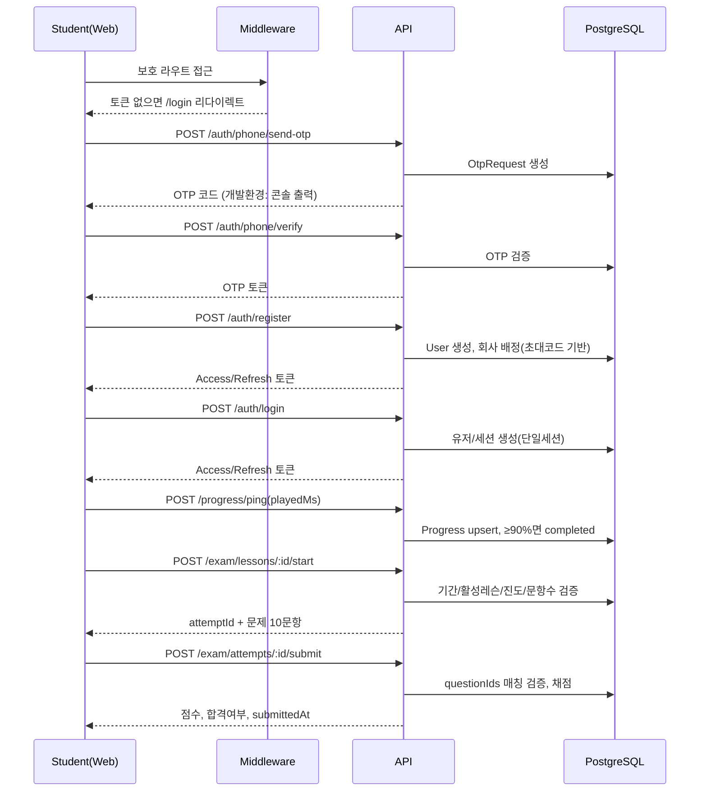
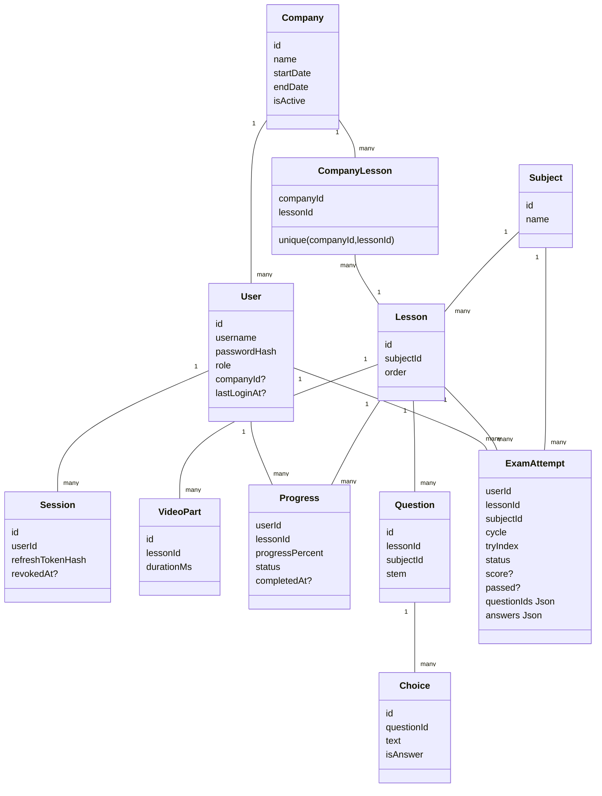

### 1. 프로젝트 개요

- 목적: 기업 및 개인 학습자를 위한 온라인 교육/평가 플랫폼. 레슨(비디오 파트) 기반 학습, 진도율 추적, 시험 응시/채점/재응시, Q&A, 회사별 수강 기간/강의 제한을 지원.
- 타겟 사용자(B2B/B2C)
  - B2B: 기업 단위 계약. 회사 기간(startDate~endDate)과 활성 레슨 목록(CompanyLesson)으로 접근 제어.
  - B2C: 개인 학습자도 계정 기반으로 동일한 학습/시험 흐름 사용 가능(회사 제약이 없는 플랜 가정).
- 핵심 기능 요약
  - 인증/보안: JWT(Access/Refresh), 단일 세션, BCrypt 비밀번호 해시.
  - 회원가입: 휴대폰 본인인증(OTP), 초대코드 기반 회사 배정, 비밀번호 정책, 3단계 스텝퍼.
  - 학습 진도: `Progress`에 진도율(%) 저장, ≥90% 시 자동 완료 처리.
  - 시험: 레슨 단위 시험, 문제은행 랜덤 10문항(3배수 보유 검증), ≥70점 합격, cycle(1/2), tryIndex(1~3) 재응시 규칙.
  - 회사 제약: 수강 기간, 활성 레슨 제한.
  - Q&A: 게시/답변 기본 플로우.
  - 문서/테스트: Swagger, 계약/E2E 테스트 기반 품질 보장.




### 2. 서비스 플로우 (역할별)

- 학생(Student)
  1) 회원가입 → 휴대폰 본인인증(OTP) → 초대코드 입력(선택) → 회사 배정
  2) 로그인 → 세션 생성(JWT Access/Refresh, 단일세션)  
  3) 레슨 학습 시작 → 비디오 파트 재생 중 `progress/ping`(playedMs 누적)  
  4) 진도율 90% 이상 → 레슨 완료 처리(inProgress→completed)  
  5) `exam/lessons/:id/start`로 시험 시작(회사 기간/활성 레슨/진도율 검증)  
  6) 10문항 랜덤 출제, `questionIds` 저장  
  7) `exam/attempts/:id/submit`로 제출 → 자동 채점 → 점수/합격  
  8) 필요 시 재응시(`retake`) 규칙(cycle/tryIndex) 적용  
  9) `progress/next-available`로 다음 학습 지점 추천

- 강사(Instructor)
  - Q&A 답변 작성
  - 시험/진도는 읽기 중심(현 코드 기준 작성/관리 API는 Admin 중심)

- 관리자(Admin)
  - 회사 생성(`company` 생성, 기간 설정, 활성 레슨 연결, 초대코드 생성)
  - 학생 회사 배정, 활성 레슨 수정
  - 회사 정보 조회(활성 레슨/학생 수 등)
  - Admin/Instructor 계정 생성 및 관리

- 회사(Company) 관점
  - 계약 기간 내에만 수강/시험 가능
  - 활성 레슨 목록 내에서만 접근 가능
  - 관리자는 계약 범위 변경 시 즉시 반영 가능




### 3. 데이터 흐름

- 수강/시험 진행 시 DB 반영
  - 회원가입: `OtpRequest` 생성 → OTP 검증 → `User` 생성 → 회사 배정(초대코드 기반)
  - 로그인: `User` 조회 → `Session` 생성(단일세션 위해 기존 세션 `revokedAt` 업데이트)
  - 진도 업데이트: `Progress(userId, lessonId)` upsert → ms 단위 합산 후 퍼센트로 환산(최대 100)
  - 시험 시작: `ExamAttempt` 생성(questionIds JSON 저장)
  - 시험 제출: `ExamAttempt` 업데이트(answers JSON, score, passed, status=submitted)

- 진도(progress) 계산 로직
  - 각 레슨의 총 재생 시간: `VideoPart.durationMs` 합
  - 현재 진도 ms = `progressPercent * totalDuration / 100`
  - 새 진도 ms = 현재 진도 ms + `playedMs`
  - 새 진도율 = min(새 진도 ms / totalDuration * 100, 100)
  - ≥90%: `status=completed`, `completedAt` 설정

- 시험 응시/채점/재응시 조건
  - 응시 전: 회사 기간 내(now ∈ [startDate, endDate]), 레슨이 회사 활성 목록에 포함, 해당 레슨 진도율 ≥90%
  - 출제: `Question` 30개 이상(3배수) 보유 → 랜덤 10문항 선택, `questionIds` 기록
  - 제출: 제출한 `answers`의 `questionId` 세트가 `questionIds`와 정확히 일치해야 함
  - 채점: `Choice.isAnswer` 기준 정오 판정, 점수=정답수/문항수×100, 합격=점수≥70
  - 재응시: cycle 1에서 tryIndex 1→3까지, 초과 시 cycle 2로 1→3, 이후 기회 없음

- Company별 수강 제한(기간/강의 목록)
  - 기간: now < startDate 또는 now > endDate → Forbidden
  - 활성 레슨: `CompanyLesson(companyId, lessonId)`에 없으면 Forbidden

```mermaid
flowchart LR
subgraph Company Window & Scope
X[User.company] -->|기간검증| P1((OK/Forbidden))
X -->|활성레슨검증| P2((OK/Forbidden))
end
subgraph Progress Update
L[VideoParts.sum(durationMs)]
P[Progress(%) calc]
end
subgraph Exam Flow
Q[Questions(>=30)]
R[Random 10 & questionIds]
S[answers match?]
G[Grade & passed>=70]
end

P1 --> P2 -->|OK| P
P2 -.->|Forbidden| stop1[403]
P --> E1[>=90%? completed]
E1 --> start[POST /exam/lessons/:id/start]
start --> Q --> R --> attempt[ExamAttempt]
attempt --> submit[POST /exam/attempts/:id/submit]
submit --> S -->|no| stop2[422]
S -->|yes| G --> result[ExamResult]
```


### 4. 데이터베이스 구조

- 주요 엔터티와 관계(요약)
  - Company 1–N User, 1–N CompanyLesson
  - CompanyLesson N–1 Company, N–1 Lesson (unique: companyId+lessonId)
  - User 1–N Session, 1–N Progress, 1–N ExamAttempt
  - Subject 1–N Lesson, 1–N Question, 1–N ExamAttempt(참조), 1–N SubjectProgress
  - Lesson 1–N VideoPart, 1–N Progress, 1–N ExamAttempt, 1–N Question
  - Question 1–N Choice
  - ExamAttempt unique(userId, lessonId, cycle, tryIndex)
  - OtpRequest: 휴대폰별 OTP 요청 관리 (phone, purpose, code, expiresAt)



- 스키마 발췌
```startLine:endLine:packages/db/prisma/schema.prisma
model Company {
  id            String   @id @default(cuid())
  name          String
  startDate     DateTime
  endDate       DateTime
  isActive      Boolean  @default(true)
  inviteCode    String?  @unique  // 6자리 영문+숫자, 관리자 직접 입력
  createdAt     DateTime @default(now())
  updatedAt     DateTime @updatedAt
  users         User[]
  activeLessons CompanyLesson[]
  @@map("companies")
}
```

```startLine:endLine:packages/db/prisma/schema.prisma
model CompanyLesson {
  id        String   @id @default(cuid())
  companyId String
  lessonId  String
  createdAt DateTime @default(now())
  company Company @relation(fields: [companyId], references: [id], onDelete: Cascade)
  lesson  Lesson  @relation(fields: [lessonId], references: [id], onDelete: Cascade)
  @@unique([companyId, lessonId])
  @@map("company_lessons")
}
```

```startLine:endLine:packages/db/prisma/schema.prisma
model User {
  id               String    @id @default(cuid())
  username         String    @unique
  passwordHash     String
  role             UserRole  @default(student)
  phone            String?   @unique  // 학생: 휴대폰 번호가 ID
  phoneVerifiedAt  DateTime? // OTP 인증 완료 시간
  email            String?   // 선택적 이메일
  companyId        String?
  lastLoginAt      DateTime?
  // ... 생략 ...
  sessions       Session[]
  progress       Progress[]
  examAttempts   ExamAttempt[]
  @@map("users")
}
```

```startLine:endLine:packages/db/prisma/schema.prisma
model Lesson {
  id        String   @id @default(cuid())
  subjectId String
  title     String
  order     Int @default(0)
  // ... 생략 ...
  videoParts      VideoPart[]
  progress        Progress[]
  examAttempts    ExamAttempt[]
  questions       Question[]
  @@map("lessons")
}
```

```startLine:endLine:packages/db/prisma/schema.prisma
model Progress {
  id              String   @id @default(cuid())
  userId          String
  lessonId        String
  progressPercent Float @default(0)
  status          ProgressStatus @default(inProgress)
  completedAt     DateTime?
  // ... 생략 ...
  @@unique([userId, lessonId])
  @@map("progress")
}
```

```startLine:endLine:packages/db/prisma/schema.prisma
model Choice {
  id         String   @id @default(cuid())
  questionId String
  text       String
  isAnswer   Boolean  @default(false)
  order      Int      @default(0)
  // ... 생략 ...
  @@map("choices")
}
```

```startLine:endLine:packages/db/prisma/schema.prisma
model ExamAttempt {
  userId       String
  lessonId     String
  subjectId    String
  cycle        Int @default(1)
  tryIndex     Int @default(1)
  status       ExamStatus @default(inProgress)
  score        Float?
  passed       Boolean?
  questionIds  Json?
  answers      Json?
  // ... 생략 ...
  @@unique([userId, lessonId, cycle, tryIndex])
  @@index([userId, lessonId, cycle])
  @@map("exam_attempts")
}
```

- 예시 데이터(Seed)
  - Company: `company-a(2024-01-01~12-31, 모든 레슨 활성, 초대코드: ACOMPA)`, `company-b(2024-03-01~08-31, lesson-1/2만 활성)`
  - Subject: `subject-math(수학)`
  - Lessons: `lesson-1, lesson-2, lesson-3`(order 1..3)
  - VideoParts: lesson-1(5개), lesson-2(3개), lesson-3(4개)
  - Questions: 레슨당 15문항, 각 4지선다(정답 1개)
  - Users: `admin`, `teacher`, `user(student, company-a 소속)`
  - SubjectProgress: 학생-수학 0% 초기화
  - OTP 시스템: 개발환경에서 콘솔 출력, 프로덕션에서 SMS 전송
  - 초대코드: 6자리 영문+숫자 조합, 관리자 직접 입력 방식


### 5. 기술 스택 및 환경

- 백엔드
  - NestJS, TypeScript, Swagger, class-validator
  - Prisma(ORM), PostgreSQL
  - 인증: JWT Access/Refresh, 단일세션(Session 테이블), BCrypt
- 프론트엔드
  - Next.js 15, TypeScript, Middleware 기반 보호 라우트
  - 클라이언트 `authClient`: 메모리 access, localStorage refresh, axios 인터셉터
- 배포 고려사항
  - 환경 변수: `DATABASE_URL`, `JWT_SECRET`, `ACCESS_TOKEN_TTL`, `REFRESH_TOKEN_TTL`
  - 마이그레이션/시드: Prisma migrate/seed
  - HTTPS, CORS, 프론트/백엔드 오리진 설정
- 로컬 개발 환경
  - PostgreSQL 구동 → `.env` 설정(`packages/db/.env.example`, `apps/api/.env.example` 참고)
  - Prisma: `prisma migrate dev`, `ts-node prisma/seed.ts` 또는 `pnpm db:seed` 스크립트
  - 앱 실행: `apps/api`(NestJS API), `apps/web`(Next.js Web)
  - Swagger: `http://localhost:4000/docs`


### 6. 예시 시나리오

- 학생 A: “1강 수강 시작 → 진도 90% 달성 → 시험 응시 → 합격 → 다음 강 해금”
  1) 학습 중 진도 누적
     - 요청
       ```http
       POST /progress/ping
       Authorization: Bearer <access>
       Content-Type: application/json

       {
         "lessonId": "lesson-1",
         "partId": "part-lesson-1-1",
         "playedMs": 180000
       }
       ```
     - 처리: 레슨 총 durationMs 합산 → 이전 진도 ms + 180,000 → 퍼센트 환산 → ≥90%면 `completed`
  2) 시험 시작
     - 요청: `POST /exam/lessons/lesson-1/start`
     - 검증: 회사 기간, 활성 레슨, 진도율≥90, 문항수≥30 → 통과 시 10문항 랜덤, `questionIds` 저장
  3) 시험 제출
     - 요청: `POST /exam/attempts/<attemptId>/submit`  
       answers의 `questionId` 집합이 attempt.questionIds와 정확히 일치해야 함
     - 채점: `Choice.isAnswer` 기준 → 점수≥70 → `passed=true`
  4) 다음 강 해금
     - `GET /progress/next-available` 또는 `GET /progress/lessons/lesson-2/status`  
       이전 레슨 합격 && 해당 레슨 진도≥90%이면 `unlocked=true`

- Company 기간 종료 후 접근 차단
  - now > `Company.endDate`인 경우:
    - `POST /progress/ping` → 403 Forbidden(“수강기간이 아닙니다.”)
    - `POST /exam/lessons/:id/start` → 403 Forbidden
    - `GET /progress/next-available` → 403 Forbidden


### 참고 API 개요(요약)

- Auth
  - POST `/auth/phone/send-otp`: 휴대폰 OTP 발송
  - POST `/auth/phone/verify`: OTP 검증 및 토큰 발급
  - POST `/auth/register`: 회원가입(OTP 토큰, 비밀번호, 초대코드)
  - POST `/auth/assign-company`: 회사 배정(초대코드)
  - POST `/auth/login`: 로그인(단일세션), Access/Refresh 발급
  - POST `/auth/refresh`: Refresh 갱신(세션 롤오버)
  - POST `/auth/logout`: 현재 세션 폐기
- Progress
  - POST `/progress/ping`: 진도 누적, ≥90%면 완료
  - GET `/progress/lessons/:id/status`: 해금/완료 여부
  - GET `/progress/subjects/:id/status`: 과목 진도/잠금
  - GET `/progress/next-available`: 다음 학습 지점
- Exam
  - POST `/exam/lessons/:id/start`: 시험 시작(랜덤 10문항)
  - POST `/exam/attempts/:attemptId/submit`: 제출/채점
  - POST `/exam/lessons/:id/retake`: 재응시 규칙 적용
- Company(관리자)
  - POST `/company`: 회사 생성(기간/활성 레슨)
  - PATCH `/company/:id/assign-students`: 학생 할당
  - PATCH `/company/:id/lessons`: 활성 레슨 변경
  - GET `/company/:id`: 상세 정보 조회
- Admin
  - POST `/admin/companies`: 회사 생성(초대코드 필수 입력)
  - PATCH `/admin/companies/:id/invite-code`: 초대코드 업데이트(필수 입력)
  - POST `/admin/users`: Admin/Instructor 계정 생성
  - GET `/admin/users`: 사용자 목록 조회
  - DELETE `/admin/users/:id`: 사용자 삭제


- 작업 사항
  - 문서화: 전체 스펙 통합 문서(본 문서)
  - 운영/개발 참여 가이드: .env 설정, 마이그레이션/시드, 서버 실행, Swagger 확인
  - 품질: 계약/E2E 테스트로 회귀 방지, 스키마/엔드포인트 동기화 유지

- 핵심 규칙 정리
  - 진도 기준: 레슨 ≥90% → 완료
  - 시험 합격: 점수 ≥70
  - 랜덤 출제: 최소 30문항에서 10문항
  - 재응시: cycle 1(try 1~3) → cycle 2(try 1~3) → 종료
  - 회사 제약: 기간 내 + 활성 레슨만 접근 가능
  - 회원가입: 휴대폰 본인인증 필수, 비밀번호 정책 준수, 3단계 스텝퍼
  - OTP: 6자리 숫자, 5분 유효시간, 레이트 리밋 적용
  - 초대코드: 회사 배정을 위한 선택적 입력, 6자리 영문+숫자, 관리자 직접 입력


- 요약
  - 역할/데이터/로직을 일관되게 연결한 교육/평가 플랫폼으로, 회사별 제약과 진도/시험의 상호작용이 핵심이다.
  - 본 문서만으로도 신규 인원이 DB/서비스 흐름/엔드포인트/로컬 실행을 즉시 이해하고 참여 가능하다.


